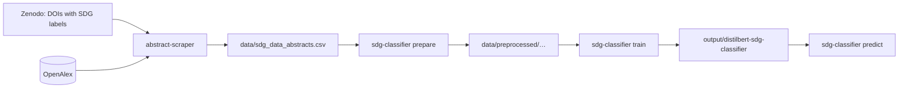

<div align="center">

# SDG Classifier

**Multi-label classification of scientific abstracts by UN Sustainable Development Goal, with DistilBERT**


[Quick start](#quick-start) · [Pipeline](#pipeline) · [Results](#results) · [Data](#data)

</div>

SDG Classifier fine-tunes [DistilBERT](https://huggingface.co/distilbert/distilbert-base-uncased) to tell which of the
17 [Sustainable Development Goals](https://sdgs.un.org/goals) (SDGs) a scientific abstract is about. An abstract can
belong to several SDGs at once.

## Features

- 🧹 **Prepare**: cleans the abstracts and splits them into train, validation and test sets that keep the label
  proportions (iterative stratification)
- 🏋️ **Train**: full fine-tuning or [LoRA](https://arxiv.org/abs/2106.09685) adapters, with a loss that weighs rare
  SDGs up
- 🔮 **Predict**: SDG probabilities for any text from the command line or from Python

> [!NOTE]
> Built in December 2024 as part of the master's thesis *Interactive Gamified System for AI-Assisted SDG Labeling in
> Scientific Research* at the University of Zurich (spring semester 2025); see
> [SDG Tag Heroes](https://github.com/HuberNicolas/sdg-tag-heroes). Rebuilt in 2026 as a package with current
> dependencies, uv and Ruff, and with a fix for the class weights (see [Results](#results)).

## Contents

- [Pipeline](#pipeline)
- [Quick start](#quick-start)
- [Usage](#usage)
- [Results](#results)
- [Data](#data)
- [Repository structure](#repository-structure)
- [Development](#development)
- [Known issues](#known-issues)
- [License](#license)
- [Author](#author)

## Pipeline



## Quick start

Requirements: [uv](https://docs.astral.sh/uv/getting-started/installation/), and a GPU or an Apple silicon Mac for
training in reasonable time.

1. Clone the repository and install the dependencies:

   ```bash
   git clone git@github.com:HuberNicolas/sdg-classifier.git
   ```

   ```bash
   cd sdg-classifier
   ```

   ```bash
   uv sync
   ```

2. Create `data/sdg_data_abstracts.csv` with [abstract-scraper](https://github.com/HuberNicolas/abstract-scraper)
   (see [Data](#data)).

3. Prepare the splits, train and predict:

   ```bash
   uv run sdg-classifier prepare --plot output/distribution.pdf
   ```

   ```bash
   uv run sdg-classifier train
   ```

   ```bash
   uv run sdg-classifier predict "Access to clean drinking water in rural villages reduces child mortality."
   ```

## Usage

| Command | What it does | Main options |
|---|---|---|
| `prepare` | Keeps rows with an abstract and at least one SDG, splits 60/20/20 and saves a Hugging Face dataset | `--input`, `--output`, `--one-label-per-row`, `--plot` |
| `train` | Fine-tunes the model, keeps the epoch with the best micro F1 on the validation set, saves the model and `metrics.json` | `--lora`, `--epochs` (5), `--batch-size` (8), `--learning-rate`, `--max-length` (128), `--no-class-weights`, `--limit` |
| `predict` | Prints the SDGs with a probability of at least `--threshold` (0.5) for each text | `--model`, `--threshold` |

`uv run sdg-classifier <command> --help` lists all options and defaults. `--limit 64 --epochs 1` makes a quick test
run. `--one-label-per-row` repeats an article with several SDGs once per SDG, as the 2024 script `duplication.py` did.

From Python:

```python
from sdg_classifier.predict import SDGClassifier

classifier = SDGClassifier("output/distilbert-sdg-classifier")
classifier.predict(["We propose a battery that stores solar energy at low cost."])  # [['SDG07']]
```

## Results

The model trained in December 2024 (full fine-tuning, 5 epochs, 18,153 abstracts) reached on the validation set:

| Micro F1 | Precision | Recall | Exact match |
|---|---|---|---|
| 0.696 | 0.776 | 0.631 | 0.601 |

> [!IMPORTANT]
> The 2024 scripts set `model.loss_fct` (and `model.config.loss_fn` for LoRA) to a weighted loss, but the Hugging Face
> models never read these attributes, so the model above was trained **without** class weights. The rebuilt
> `train` command applies the weights in the trainer's loss. The 2024 split was random; the new one is seeded, so the
> numbers are not directly comparable. The model has not been retrained since the fix.

## Data

The data is not part of the repository.

- **Labels:** [DOI's with SDG labels on Target level](https://doi.org/10.5281/zenodo.5224005) by Maurice Vanderfeesten
  (Zenodo, 2021, [CC BY 4.0](https://creativecommons.org/licenses/by/4.0/)).
- **Abstracts:** fetched from [OpenAlex](https://openalex.org/) with
  [abstract-scraper](https://github.com/HuberNicolas/abstract-scraper). The abstracts can be under the copyright of
  their publishers and are therefore not shared here.

`prepare` expects a CSV with an `abstract` column and the columns `SDG01` to `SDG17` (1 = labelled). Other columns,
such as `doi`, are ignored.

## Repository structure

| Path | Content |
|---|---|
| [`src/sdg_classifier/cli.py`](src/sdg_classifier/cli.py) | Command-line interface |
| [`src/sdg_classifier/data.py`](src/sdg_classifier/data.py) | Cleaning, one-label-per-row expansion, stratified split, distribution plot |
| [`src/sdg_classifier/train.py`](src/sdg_classifier/train.py) | Tokenising, weighted loss, LoRA, metrics, training |
| [`src/sdg_classifier/predict.py`](src/sdg_classifier/predict.py) | Loading a trained model and predicting |
| [`tests/`](tests/) | Tests for the data preparation |

## Development

| Task | Command |
|---|---|
| Run the tests | `uv run pytest` |
| Lint | `uv run ruff check .` |
| Format | `uv run ruff format .` |
| Quick training run | `uv run sdg-classifier train --limit 64 --epochs 1 --output output/test` |

## Known issues

- Current PyTorch has no builds for Intel Macs; use Linux, Windows or an Apple silicon Mac.
- The 2024 model was trained without class weights (see [Results](#results)). Loading it logs
  `loss_fct.pos_weight | UNEXPECTED`; this can be ignored.
- Only the first 128 tokens of each abstract are used; raise `--max-length` (up to 512) at the cost of training time.

## License

The code is licensed under the [GNU General Public License v3.0](LICENSE). The data sources under [Data](#data) keep
their own licenses.

## Author

Nicolas Huber · [GitHub](https://github.com/HuberNicolas) · nicolas.huber.dev@gmail.com
